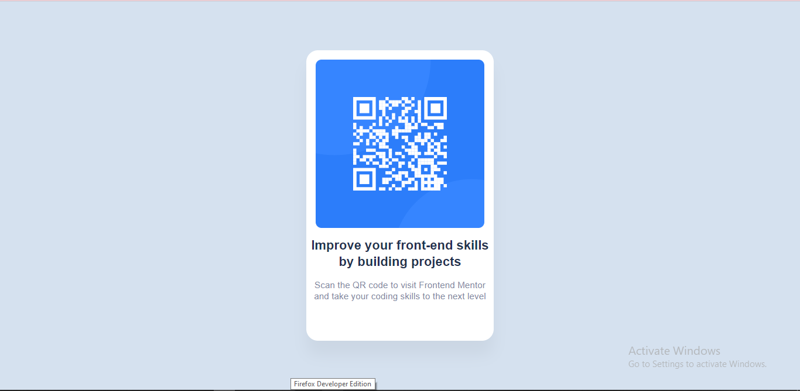

# Frontend Mentor - QR code component solution

This is a solution to the [QR code component challenge on Frontend Mentor](https://www.frontendmentor.io/challenges/qr-code-component-iux_sIO_H). Frontend Mentor challenges help you improve your coding skills by building realistic projects. 

## Table of contents

- [Overview](#overview)
  - [Screenshot](#screenshot)
  - [Links](#links)
- [My process](#my-process)
  - [Built with](#built-with)
  - [What I learned](#what-i-learned)
- [Author](#author)

## Overview

### Screenshot

### Links

- Solution URL: [Add solution URL here](
https://glitch.com/edit/#!/quark-whimsical-scapula)
- Live Site URL: [Add live site URL here](https://quark-whimsical-scapula.glitch.me)
- Projet likn on GitHub: [Here](https://itsmeelo.github.io/QR-code-component/)

## My process

### Built with

- Semantic HTML5 markup
- CSS custom properties
- Flexbox

### What I learned
- Markdown
- Html;
- Css;
- JavaScript

## Author

- GitHub [Elena Kuparadze](https://github.com/Itsmeelo)

